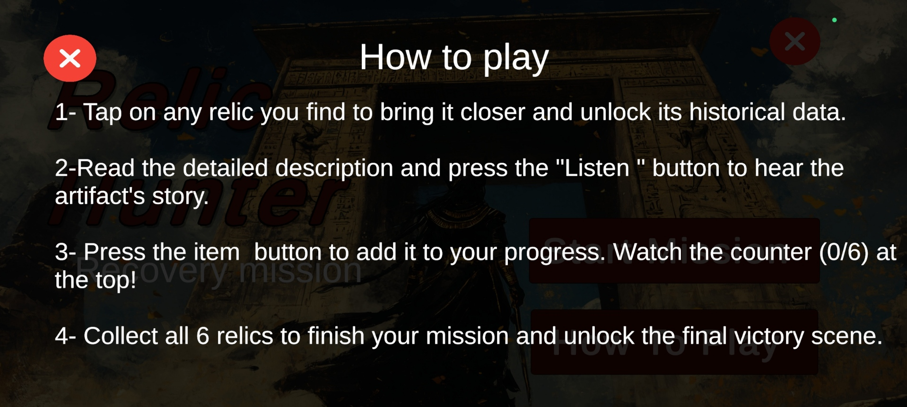
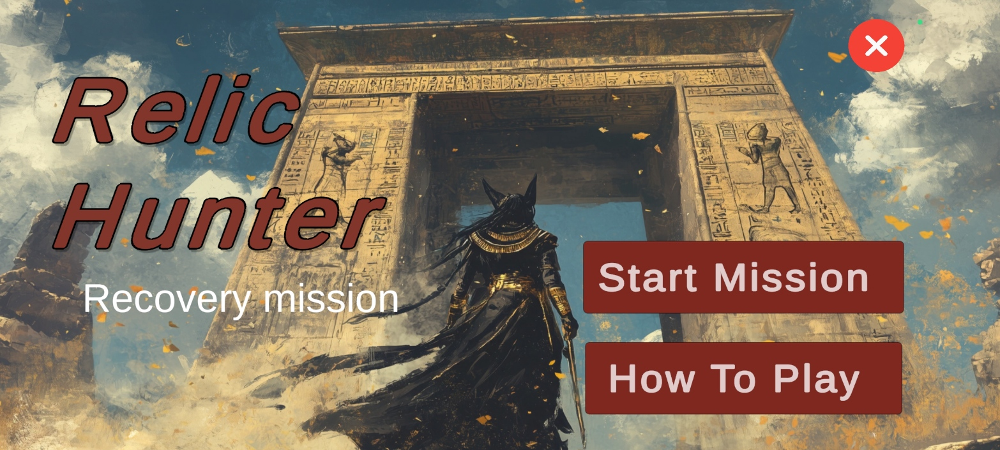
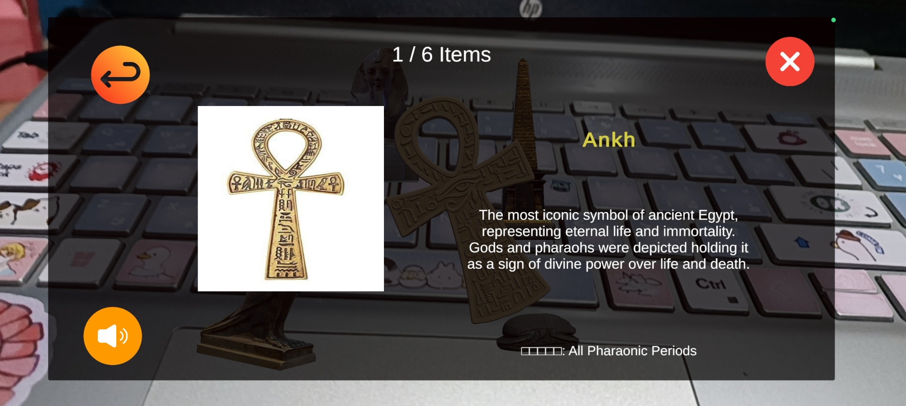
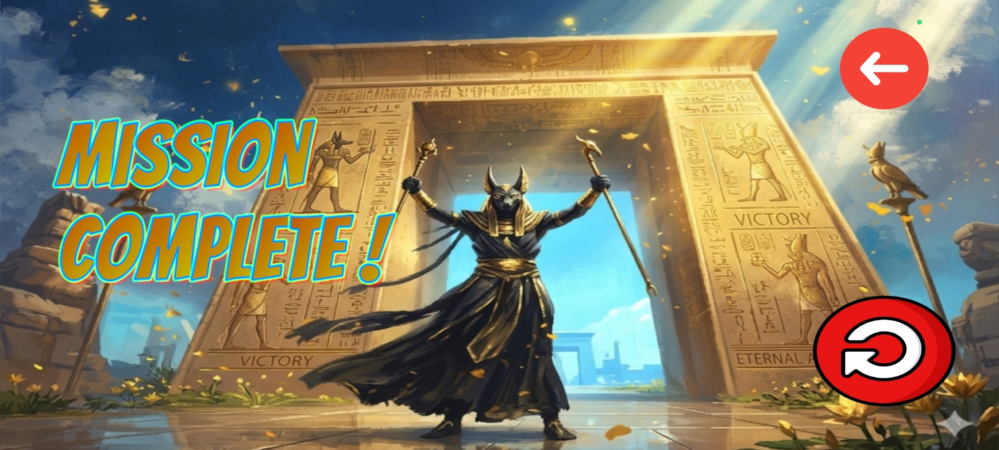

# 🏺 AR Relic Hunter — The Secret Relic Room: Recovery Mission

**AR Relic Hunter** is an interactive educational Augmented Reality (AR) application. It merges entertainment with learning by allowing users to explore and collect ancient Egyptian artifacts distributed within their real-world environment.

---

## 🎯 Project Overview

*   **Project Name:** AR Relic Hunter — The Secret Relic Room.
*   **Type:** Augmented Reality Educational Game.
*   **Platform:** Android.
*   **Engine:** Unity 2022.3 LTS.
*   **AR SDK:** Vuforia Engine.
*   **Target Audience:** Students and history enthusiasts.

---

## 🏗️ Project Architecture

The project is structured into three main scenes to ensure a smooth user experience:

1.  **Menu Scene:** The starting screen and gateway to the archaeological world.
2.  **Game Scene:** The core stage where artifacts are searched for and collected.
3.  **Victory Scene:** The celebration screen upon successful mission completion.

---

## 🎬 Scene 1: Main Menu

This screen appears immediately upon launching the app, providing a simple interface to start the mission or read instructions.

### Core Components
*   **MenuManager.cs:** Script controlling button functionality and scene transitions.
*   **AudioSource:** Plays ancient-themed background music and button sound effects.
*   **Instructions Panel:** An overlay showing the player how to interact with the game.

---

## 🎮 Scene 2: AR Experience (Game Scene)

In this scene, the AR camera activates, and the search for treasures begins in the real world.

### 🛠️ Gameplay Mechanics
*   **Artifact Spawning:** The `SpawnManager.cs` automatically distributes 6 artifacts in a circle around the player.
*   **Interaction:** Tapping a relic triggers a Raycast, causing the object to fly towards the camera and enlarge for inspection.
*   **Information:** An `InfoPanel` displays the relic's name, historical era, and description, with optional narration.

### 🏺 Available Artifacts (Relic Data)
| Relic | Historical Era | Significance |
| :--- | :--- | :--- |
| **Ushabti** | New Kingdom | Statuettes placed in tombs to serve the deceased. |
| **Sacred Scarab** | Middle Kingdom | Symbol of renewal, rebirth, and protection. |
| **Canopic Jar** | Old Kingdom | Used to preserve the internal organs of the deceased. |
| **Eye of Horus** | All Eras | Universal symbol of protection, health, and power. |
| **Ankh** | All Eras | The key of life and symbol of immortality. |
| **Anubis Statue**| Old Kingdom | God of mummification and protector of graves. |

---

## 🏆 Scene 3: Victory Scene

Triggered once all six relics are collected, rewarding the player with celebratory music and a mission success message.

*   **Options:** Players can choose to "Play Again" or return to the "Main Menu".

---

## 🔧 Technical Specifications

*   **Min System Req:** Android 8.0 (API 26).
*   **Architecture:** ARM64 with IL2CPP scripting backend.
*   **UI System:** TextMeshPro for crisp historical data display.
*   **Data Management:** ScriptableObjects for storing relic metadata (Name, Bio, Audio).

---

## 📦 Assets Credits

*   **3D Models:** Sketchfab (Egyptian Heritage models).
*   **Fonts:** Google Fonts.
*   **Sound & Music:** Mixkit.
*   **Backgrounds:** AI Generated.

---
*Developed as an educational prototype blending ancient Egyptian heritage with modern technology.*
